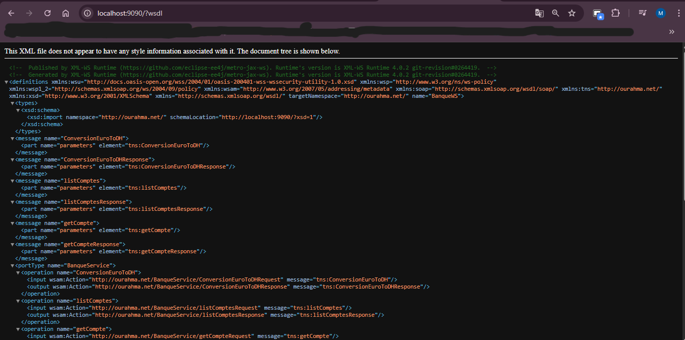
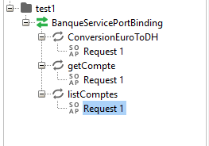
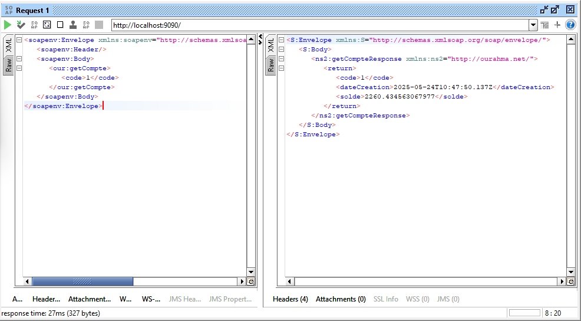
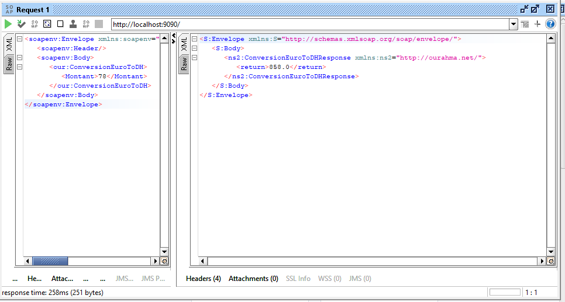
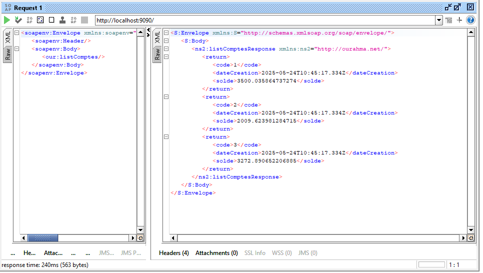
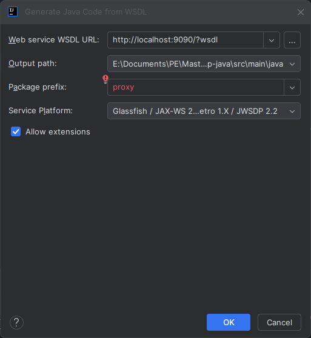
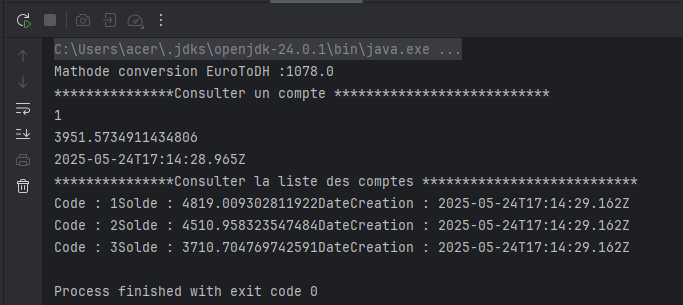

# WS SOAP
* Nom : OURAHMA.
* Prènom : Maroua.
* Filière : Master en Intelligence artificielle et sciences de données
* Universitè : Facultès des sciences Universitè Moulay Ismail Meknès.
---
## **1- Introduction :**
Dans le cadre de ce projet, nous avons développé un service web SOAP en Java permettant de convertir des montants en euros vers le dirham marocain, ainsi que de consulter un compte bancaire ou une liste de comptes. Le service a été déployé à l’aide d’un serveur JAX-WS simple. Nous avons analysé le fichier WSDL généré via un navigateur HTTP, puis testé les opérations du service avec l’outil SoapUI. Enfin, nous avons créé un client Java utilisant le stub généré à partir du WSDL pour interagir avec le service web de manière programmatique.

`JAX-WS (Java API for XML Web Services)` est une API Java qui permet de créer et d'implémenter des services web `SOAP` de manière simple et standardisée. Elle fait partie de la plateforme `Java EE` (anciennement J2EE) et facilite le développement de services web basés sur le protocole SOAP (Simple Object Access Protocol).

**Fonctionnalités principales de JAX-WS :**
- Création facile de services web SOAP en ajoutant des annotations Java.
- Génération automatique du `WSDL (Web Services Description Language)`.
- Gestion des échanges de messages SOAP via des méthodes Java.
- Support de la sécurité, des sessions, et des handlers pour personnaliser les requêtes/réponses.

## **2- Enoncé :**

1. Créer un Web service qui permet de : • Convertir un montant de l’euro en DH
    • Consulter un Compte
    • Consulter une Liste de comptes
2. Déployer le Web service avec un simple Serveur JaxWS
3. Consulter et analyser le WSDL avec un Browser HTTP
4. Tester les opérations du web service avec un outil comme SoapUI ou Oxygen
5. Créer un Client SOAP Java
      - Générer le Stub à partir du WSDL
      - Créer un client SOAP pour le web service

## **3- Implémentation :**

La classe **Compte** représente une entité métier qui modélise un compte bancaire dans une application. Elle encapsule les données essentielles d’un compte, à savoir :

- Le code (numéro) du compte
- Le solde actuel
- La date de création du compte
- Elle permet de stocker et de manipuler les informations relatives à un compte bancaire au sein de l’application.

**1. La classe `Compte.java`**
```java
package net.ourahma.entities;

import java.util.Date;

public class Compte {
    private int code;
    private double solde;
    private Date dateCreation;

    public Compte(int code, double solde, Date dateCreation) {
        this.code = code;
        this.solde = solde;
        this.dateCreation = dateCreation;
    }

    public Compte() {
    }

    public void setCode(int code) {
        this.code = code;
    }

    public void setDateCreation(Date dateCreation) {
        this.dateCreation = dateCreation;
    }

    public void setSolde(double solde) {
        this.solde = solde;
    }

    public int getCode() {
        return code;
    }

    public double getSolde() {
        return solde;
    }

    public Date getDateCreation() {
        return dateCreation;
    }
}

```
**Interprétation de ce code**
- `private int code`: Représente le numéro ou identifiant unique du compte bancaire.
- `private double solde`: Stocke le solde actuel du compte , c’est-à-dire la somme d’argent disponible.
- `private Date dateCreation`: Indique la date à laquelle le compte a été créé .

**2. La classe `BanqueService.java`:**

La classe `BanqueService` est une implémentation d’un **service web SOAP** développé avec **JAX-WS (Java API for XML Web Services)** . Elle expose trois opérations principales :

1. **Conversion d’un montant en euros vers le dirham marocain (DH).**
2. **Consultation d’un compte bancaire par son code.**
3. **Liste de comptes bancaires.**

Ce service web peut être consommé via des clients SOAP tels que `SoapUI` ou un client Java générant un stub à partir du WSDL généré automatiquement par JAX-WS.

```java
package net.ourahma;

import jakarta.jws.WebMethod;
import jakarta.jws.WebParam;
import jakarta.jws.WebService;
import net.ourahma.entities.Compte;

import java.time.LocalDate;
import java.util.Date;
import java.util.List;
@WebService(serviceName = "BanqueWS")
public class BanqueService {
    @WebMethod(operationName = "ConversionEuroToDH")
    public double conversion(@WebParam(name="Montant") double mt){
        return mt*11;
    }
    // si le nom n'est pas spécifié elle prendra le meme nom que la méthode
    @WebMethod()
    public Compte getCompte(@WebParam(name = "code") int code){
        return new Compte(code, Math.random()*6800, new Date());
    }
    @WebMethod()
    public List<Compte> listComptes(){
        return List.of(
                new Compte(1, Math.random()*6800, new Date()),
                new Compte(2, Math.random()*6800, new Date()),
                new Compte(3, Math.random()*6800, new Date())
        );
    }
}

```
**Interprétation de cette classe :**

- `@WebService` : marque la classe comme un service web.
- `@WebMethod` : indique qu’une méthode est exposée comme opération du service.
- `@WebParam` : permet de personnaliser le nom des paramètres dans le WSDL.

**3. La classe `ServerJWS.java` :**
La classe `ServerJWS` joue le rôle de serveur d'hébergement du service web développé avec `JAX-WS` . Elle permet de déployer localement le service BanqueService sur une adresse URL spécifique, rendant ainsi les opérations qu’il expose accessibles via le protocole SOAP.

Ce déploiement utilise une implémentation simple de `JAX-WS` basée sur une plateforme Java SE , sans avoir besoin d’un serveur d’application lourd comme GlassFish ou WildFly. Il s'agit donc d'une solution légère et efficace pour tester et exposer des services web localement.

```java
package net.ourahma;

import jakarta.xml.ws.Endpoint;

public class ServerJWS {
    public static void main(String[] args) {
        // déployer le projet dans ce lien
        String url = "http://0.0.0.0:9090/";
        Endpoint.publish(url, new BanqueService());
        System.out.println("Web service déployé sur l url " + url);
    }
}
```
**Interprétation de ce code :**

- `Endpoint`, une classe de la bibliothèque JAX-WS pour publier un service web.
- La classe `ServerJWS` contient une méthode `main`, c’est le point de départ de l’exécution du programme.
- L’URL est définie pour héberger le service :
  - `0.0.0.0` signifie que le service sera accessible depuis toutes les adresses IP du réseau.
  - `9090` est le port sur lequel le service sera accessible.
- Le service web `BanqueService` est publié à cette URL avec la ligne

**L'exécution de ce code :**


**Récupération de `wsdl`**


**Tester le serveur avec `SoapUI`**
- Création de projet :


- Tester la méthode `getCompte()`:


- Tester la méthode `ConversionEuroToDH` :



- Tester la méthode `listComptes()` :


**4. La classe `Main.java` dans le module `client-soap-java`**

un module `client-soap-java` a été ajouté pour consommer un service SOAP. Le code client a été généré automatiquement à partir du lien WSDL, permettant d'interagir facilement avec le service web BanqueService.



Cette classe permet de tester les fontionnalités en tant que client :

```java
package net.ourahma;

import proxy.BanqueService;
import proxy.BanqueWS;
import proxy.Compte;

public class Main {
    public static void main(String[] args) {
        BanqueService proxy = new BanqueWS().getBanqueServicePort();
        System.out.println("Mathode conversion EuroToDH :"+proxy.conversionEuroToDH(98));
        System.out.println("***************Consulter un compte ***************************");
        Compte compte = proxy.getCompte(1);
        System.out.println(compte.getCode());
        System.out.println(compte.getSolde());
        System.out.println(compte.getDateCreation());
        System.out.println("***************Consulter la liste des comptes ***************************");
        proxy.listComptes().forEach(c ->{
            System.out.println("Code : "+c.getCode()+"Solde : "+c.getSolde()+"DateCreation : "+c.getDateCreation());
        });
    }
}
```

**Interprétation de ce code :**

- L’objet `BanqueService proxy` est créé via :
  ```java
  new BanqueWS().getBanqueServicePort();
  ```
  Cela crée une connexion avec le service SOAP distant via un port généré depuis le WSDL.
-  Appel à la méthode conversionEuroToDH(98) pour convertir un montant en euros vers dirhams.
- Consultation d’un compte bancaire avec l’ID 1.
- Appel à la méthode listComptes() pour récupérer et afficher la liste de tous les comptes bancaires.
- La liste est parcourue avec forEach, et les détails de chaque compte sont affichés en console.

> Les classes `BanqueWS`, `BanqueService`, et Compte ont été générées automatiquement à partir du fichier WSDL via un outil comme wsimport. Elles permettent de communiquer avec le service sans écrire manuellement le code SOAP.

**L'exécution de ce code**


## **4- Conclusion :**

Ce travail pratique a permis de mettre en œuvre un service web SOAP avec JAX-WS, incluant la conversion de devises et la gestion des comptes bancaires. Le déploiement sur un serveur intégré, l’analyse du WSDL et les tests avec SoapUI ont validé le bon fonctionnement du service. La création d’un client Java à partir du WSDL a également été réalisée, assurant ainsi une intégration complète et fonctionnelle du système.

## **5- Auteur**

- **Nom:**  OURAHMA
- **Prénom:** Maroua
- **Courriel:** [Email](mailto:marouaourahma@gmail.com)
- **LinkedIn:** [Linkedin](www.linkedin.com/in/maroua-ourahma)